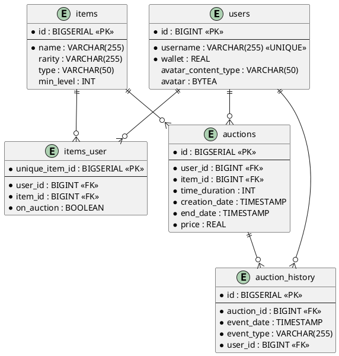
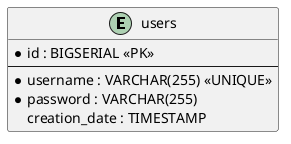

# Dokumentacja REST API (MMO Auctions)

## Przeznaczenie
Projekt REST API w języku Go pełni rolę warstwy pośredniczącej (gateway), która umożliwia klientom komunikację z głównym systemem zaplecza (opartym prawdopodobnie na Springu) za pośrednictwem protokołu gRPC. Głównym zadaniem jest obsługa użytkowników, zarządzanie ich ekwipunkiem, profilami (awatarami) oraz aukcjami przedmiotów.

## Zakres funkcjonalny
* **Autoryzacja**: Weryfikacja danych użytkownika i wydawanie tokenów JWT.
* **Zarządzanie ekwipunkiem**: Pobieranie listy posiadanych przedmiotów oraz operacje dodawania i usuwania przedmiotów.
* **Obsługa mediów**: Wgrywanie oraz pobieranie plików awatarów użytkowników.
* **Aukcje**: Dostęp do listy wszystkich aktywnych aukcji w systemie.
* **Katalogowanie**: Możliwość przeglądania pełnego katalogu przedmiotów dostępnych w grze.
* **Monitorowanie**: Zbieranie i wyświetlanie statystyk użycia endpointów API.

## Endpointy API

| Metoda | Endpoint | Opis |
| :--- | :--- | :--- |
| `POST` | `/api/login` | Logowanie użytkownika i uzyskanie tokena |
| `GET` | `/api/inventory` | Pobranie przedmiotów z ekwipunku użytkownika |
| `POST` | `/api/avatar/upload` | Przesłanie pliku graficznego awatara |
| `GET` | `/api/avatar/download` | Pobranie pliku awatara użytkownika |
| `GET` | `/api/auctions` | Lista wszystkich dostępnych aukcji |
| `GET` | `/api/items` | Katalog wszystkich przedmiotów w systemie |
| `POST` | `/api/items/add` | Dodanie przedmiotu do ekwipunku |
| `DELETE`| `/api/items/delete` | Usunięcie przedmiotu z ekwipunku |
| `GET` | `/api/stats` | Pobranie statystyk użycia endpointów |

## Uwagi techniczne
* API wykorzystuje `GrpcClient` do komunikacji z usługą RPG.
* Operacje zabezpieczone wymagają autoryzacji typu `BearerAuth` przekazywanej w nagłówku żądania.
* W przypadku przesyłania plików (avatar), wprowadzono limit wielkości formularza wynoszący 1MB.
* Statystyki użycia endpointów (liczba wywołań w podziale na ścieżkę, metodę i status HTTP) są gromadzone w bazie danych SQLite.

## Diagramy ERD
### 1. Baza podstawowa

### 2. Baza autoryzacyjna

